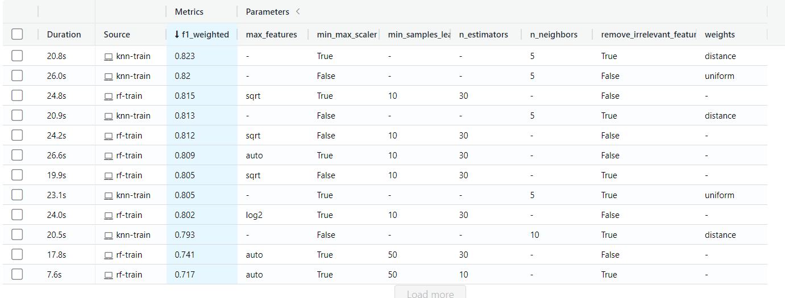
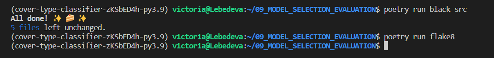
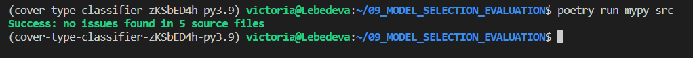

# Forest Cover Type Prediction 
## Capstone project (RS School ML Course 2022)

This project uses [Forest Cover Type Prediction](https://www.kaggle.com/competitions/forest-cover-type-prediction/data) dataset.

## Project navigation
* [Project structure](https://github.com/VictoriaLebedeva/model_selection_evaluation#project-structure)
* [Configuring local enviroment](https://github.com/VictoriaLebedeva/model_selection_evaluation#configuring-local-enviroment)
* [Usage](https://github.com/VictoriaLebedeva/model_selection_evaluation#usage)
* [Development](https://github.com/VictoriaLebedeva/model_selection_evaluation#development)


## Project structure
```
|- assets                              <---- Screenshots of the code check
|- models                              <---- Models predictions
|- notebooks                           <---- EDA and data and model researches                   
│- src  
│   └─ cover_type_classifier           <---- Source code for the project
│       │- models                      <---- Scripts for training, tuning models, making predictions
│       |   |- knn_train.py
│       |   |- random_forest_train.py
│       |- data                        <---- Scripts for data processing (EDA report)
│       |   |- generate_eda.py
│       |   |- get_dataset.py
│       │- init.py                     <---- Makes src a Python module
│- tests                               <---- Project tests
|   │- ... (to be done)
|- .gitignore
|- LICENSE
|- poetry.lock                         <---- Project dependencies
|- pyproject.toml                      <---- Project dependencies
|- README.md                           <---- Project description
```

## Configuring local enviroment
This package allows you to train model for forest cover type prediction. 

Before starting using this package, it is necessary to check the version of Python. It can be done with the following command:
```sh
python --version
```
This project requiers Python of version upper 3.9.

Also check whether Poetry is installed.

```sh
poetry --version
```
If everything is installed, move to the usage instruction.

1. Clone repository.
2. Download  dataset from the website [Forest Cover Type Prediction](https://www.kaggle.com/competitions/forest-cover-type-prediction/data), save csv locally (default path is data/external/train.csv in repository's root).
3. Install necessary dependencies by running the following commands in terminal.
```sh
poetry install --no-dev
```
## Usage 

This project provides the following abilities:
 * Generate EDA report using pandas-profiler or sweetviz and save report on the local machine.
    ```sh
    poetry run generate-eda \
    --profiler <pandas-profiler or sweetviz> \
    --dataset-path <path to csv file> \
    --report-path <directory, to save report>
    ```
 * **Train classifiers**  
   **NOTE (for reviewers)** Making predictions for data in test.csv takes much time, so in order to make homework check faster I added parameter **nrows**. It will allow to read only part of the data. By default all row of the dataset will be read.

   **kNN**
   ```sh
   poetry run knn-train \
   --dataset-path <path to train data> \
   --test-path <path to test data> \
   --report-path <path,where to save predictions> \
   --nrows <number of rows to read from file> \
   --n-neighbors <knn param: number of neighbors> \
   --weights <knn param: distance weights>
    ```

    **Random Forest**
   ```sh
   poetry run rf-train \
   --dataset-path <path to train data> \
   --test-path <path to test data> \
   --report-path <path,where to save predictions> \
   --nrows <number of rows to read from file> \
   --max-features <random forest param: number of features, used in each tree> \
   --n-estimators <random forest param: the number of trees in the forest> \
   --min-samples-leaf <random forest param: minimum number of samples required to be at a leaf node>
    ```

### **Experiments** 
Manual parameter tuning experiments can be seen in MLFlow UI. Run MLFrow using the following command:
 ```sh
   poetry run mlflow ui
```
Then follow the link listed under **Listening at** (for example, http://<i></i>127.0.0.1:\<port\>). After clicking on the link you will see the scoreboard with the results of the experiments. For example, the following screenshot shows the results of the experiment with **kNN** and **Random Forest Classifier**.


## Development

* Formatting and linting project

  To format the code, run the following command:
  ```sh
  poetry run black src
  ```
  And for linting code, use the command
  ```sh
  poetry run flake8
  ```
  Then, you will get something like this:
  

* Checking type annotation

  To check static type annotation, run the following command:
   ```sh
   poetry run mypy src
    ```
  If there are no errors, you will get the following report:
  